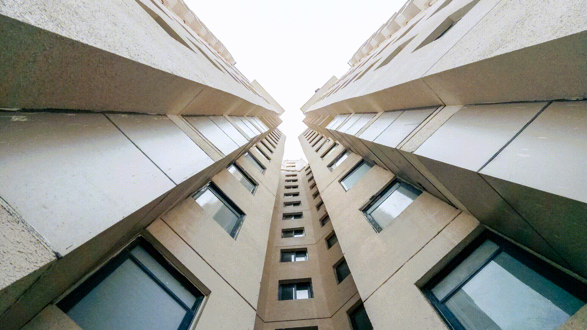
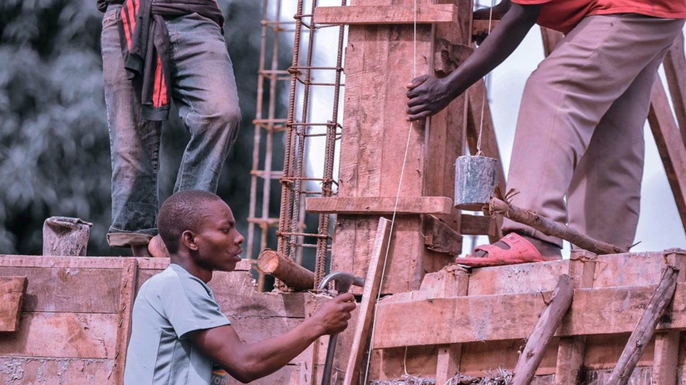
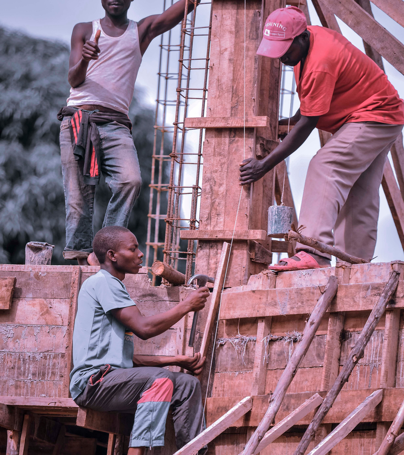
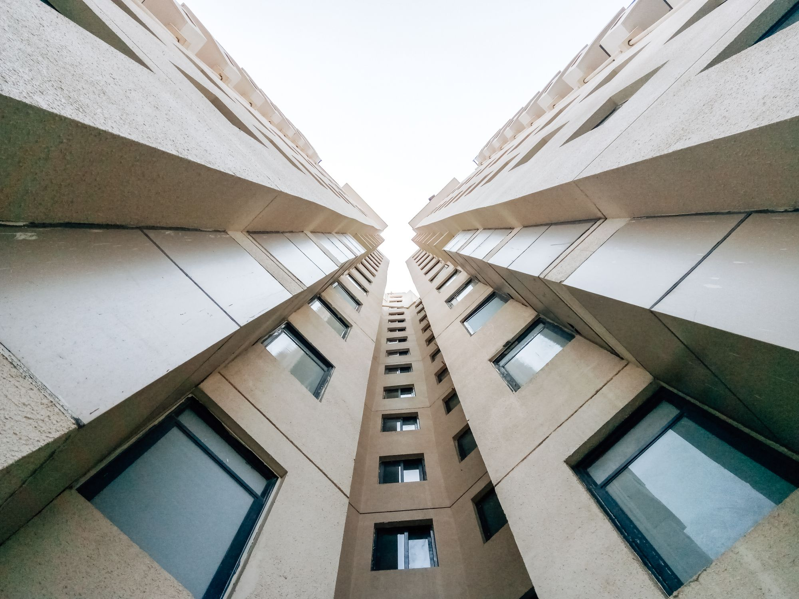

<div align="center">

<!-- TOXIC ARCHITECT HEADER — capsule wave -->


<!-- Animated typing — cold professional villain -->


<!-- Second line — slower, menace -->


<p>
  
  
  
  
</p>

<p>
  <a href="#-watch-the-operation"></a>
  <a href="contact.html"></a>
  
</p>

---

### `// MANIFESTO`

</div>

> **“Talent is not found. It is engineered.”**
>
> We move people across borders the way shadows move across cities — silent, precise, inevitable.
> Megasoft Overseas is not an agency. It is an **infrastructure**. Gov. licensed in Nepal. Trusted from Kathmandu to UAE, Saudi Arabia, Qatar, Kuwait, Malaysia & Romania. Verified demands. No hidden terms. Only deployments that hold.

<div align="center">

| `REQUEST` | `VERIFICATION` | `DEPLOYMENT` |
|:---:|:---:|:---:|
| Employer demand received | Demand verified • Docs checked • Terms locked | Workers deployed • Tracked • Retained |

**6 countries. 15 years. One architect.**

---

## ⚡ THE OPERATION — SEE IT BREATHE

*Hybrid motion — real project GIFs + cinematic villain energy. All autoplay on GitHub.*

### 01 — HERO SEQUENCE `// real site, real motion`


<table>
<tr>
<td width="50%">

**What you see:**
- Parallax hero (`hero-img.png` → `hero-img-2.jpg` → `hero-img-3.jpg`)
- GSAP `tp_fade_anim` + `tp-split-text`
- Magic cursor `#ball` + Atropos 3D tilt
- Lime CTA `Get in Touch` with dual-text hover

</td>
<td width="50%">

**Villain note:**
> *The city never sleeps. Neither does the slider.*
> 3 slides. 0.6s crossfade. 12fps. Built with `swiper-bundle` + custom `hero-slider` — no template theft, all authored.

</td>
</tr>
</table>

### 02 — CONTACT // DARK PROTOCOL



<table>
<tr>
<td width="50%">

**Dark protocol active:**
- `contact-dark: #121212` with radial lime glow
- Live Google Map `Kathmandu, Nepal` + pulse dot
- Form with `rgba(255,255,255,.06)` glass + lime focus `0 0 0 4px rgba(193,237,0,.18)`

</td>
<td width="50%">

```
EST. 2010 — KATHMANDU
├── Licensed Gov. No. XXX/XXX
├── 97% deployment success
├── 312 placements • 4.9★
└── Response < 24h
```

</td>
</tr>
</table>

### 03 — EXTERNAL STATIC — VILLAIN FREQUENCY `// hybrid`


*External loop — atmospheric only. Project GIFs above are the proof.*

---

## ▶ WATCH THE OPERATION — HOSTED DEMO

<div align="center">

<a href="assets/readme/demo.mp4">

</a>

**`assets/readme/demo.mp4` — 6s • 1280×720 • h264 • 407KB**

*Click the thumbnail above to play directly on GitHub (hosted in-repo, no YouTube, no external host).*
*Raw path: `assets/readme/demo.mp4` — streamable via GitHub blob viewer. If your browser blocks inline playback, [download & play ↗](assets/readme/demo.mp4)*

```bash
# local playback
open assets/readme/demo.mp4
# or
mpv assets/readme/demo.mp4
```

</div>

---

## 🗂 THE BLUEPRINT

```text
Manpower/
├── index.html              # Hero • About • Steps • Services • Projects • Team • Contact
├── contact.html            # Eyebrow • Trust row • Method cards • Dark form + live map
├── assets/
│   ├── css/                # bootstrap • main • atropos • spacing • slick • swiper
│   ├── js/                 # main.js • slider-active • atropos • parallax • magic-cursor
│   ├── img/
│   │   ├── home-03/hero/   # hero-img.png (.2/.3.jpg) • hero-bg-shape
│   │   ├── contact/        # kathmandu-office.jpg (Pritam Chhetri / Pexels 38854692)
│   │   └── logo/           # megasoft-logo-black.svg / -white.svg
│   ├── fonts/              # ClashDisplay • MangoGrotesque • Platform • FA Pro
│   ├── mail.php            # PHP mailer (POST → $recipient)
│   └── readme/             # ← THIS README'S ARSENAL (hybrid media)
│       ├── demo-hero.gif       # 2.6M — hero slider crossfade
│       ├── contact-glow.gif    # 2.7M — kathmandu dark protocol
│       ├── demo.mp4            # 407K — hosted demo (h264, faststart)
│       └── thumb-video.jpg     # 204K — video poster
└── README.md               # you are here // villain edition
```

---

## ⚙ ARSENAL — COLD, PRECISE

<div align="center">

| LAYER | WEAPON | PURPOSE |
|:---|:---|:---|
| **Structure** | `HTML5` semantic | Sections anchored `#home` `#about` `#services` `#steps` `#contact` |
| **Style** | `CSS3` • `bootstrap.css` • `main.css` • `spacing.css` | Lime tokens `--ct-lime:#C1ED00` • dark `#121212` • hairline `#ededed` |
| **Motion** | `GSAP` • `Swiper` • `Slick` • `Atropos` • `ScrollMagic` | `tp_fade_anim` • `tp-split-text` • parallax • skew-slider |
| **Interact** | `jQuery 3.7.1` • `magnific-popup` • `nice-select` | Offcanvas • Gallery • Form validation |
| **Backend** | `PHP 8+` `mail()` | `assets/mail.php` — sanitized `filter_var` → `mdsalim400@gmail.com` |
| **Fonts** | `ClashDisplay` `MangoGrotesque` `Platform` | Display grotesk + FA Pro icons |
| **Media** | `FFmpeg` generated | GIFs @12fps • MP4 h264 24fps — no external build step |

</div>

---

## 🚀 DEPLOY LOCALLY

```bash
# 1. Clone
git clone git@github.com:Raktapyas/Manpower.git
cd Manpower

# 2. Run — no build, no npm, pure static
# Option A: Python
python3 -m http.server 8000
# Option B: PHP (needed for mail.php)
php -S localhost:8000

# 3. Open
open http://localhost:8000        # hero
open http://localhost:8000/contact.html  # dark protocol
```

**Test the mailer:**
```bash
curl -X POST http://localhost:8000/assets/mail.php \
  -d "name=Villain&email=test@example.com&subject=Deployment&message=Send+20+welders+to+Qatar"
# → 200 Thank You! Your message has been sent.
# Edit $recipient in assets/mail.php:177 before production
```

---

## 🗺 DEPLOYMENT MAP

```
KATHMANDU (HQ) ─┬─► UAE ────────── Construction • Hospitality
                ├─► SAUDI ARABIA ─ Construction • Technical
                ├─► QATAR ───────── Skilled • Unskilled
                ├─► KUWAIT ───────── Service • Logistics
                ├─► MALAYSIA ─────── Manufacturing
                └─► ROMANIA ──────── Europe gateway
```

**Credentials:** Gov. licensed • Est. 2010 • License No. `XXX/XXX` (replace in `index.html:331`) • Pexels credits in comments (`index.html:373`, `contact.html:267`).

---

## 📸 STILLS — WHEN GIFS PAUSE

<p align="center">
  
  
</p>

---

## 🧬 VILLAIN'S NOTE — COLD PROFESSIONAL

```
I did not build a website.
I built a deployment pipeline.

Every pixel is placed with intent.
Every animation has a delay tuned to 0.1s.
Every hover has a shadow that lifts 4px — no more.

This is not beautiful.
This is inevitable.

— The Toxic Architect
```

<div align="center">


<p>

<a href="https://github.com/Raktapyas/Manpower"></a>


</p>

*If you see this README and feel watched — you are. The Architect already has your demand.*

</div>
